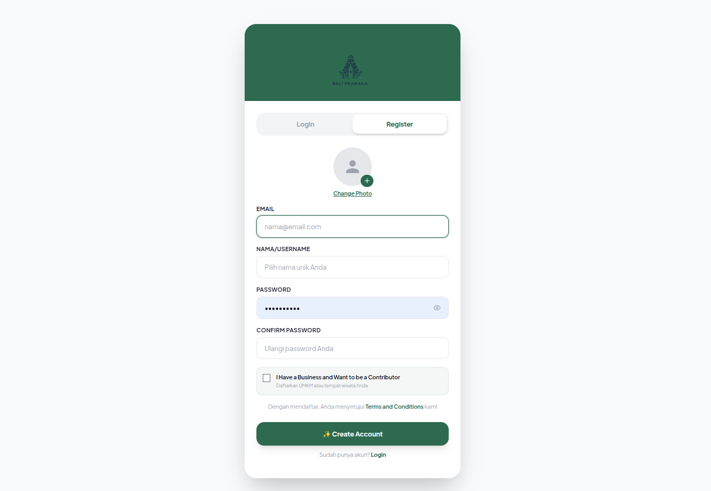
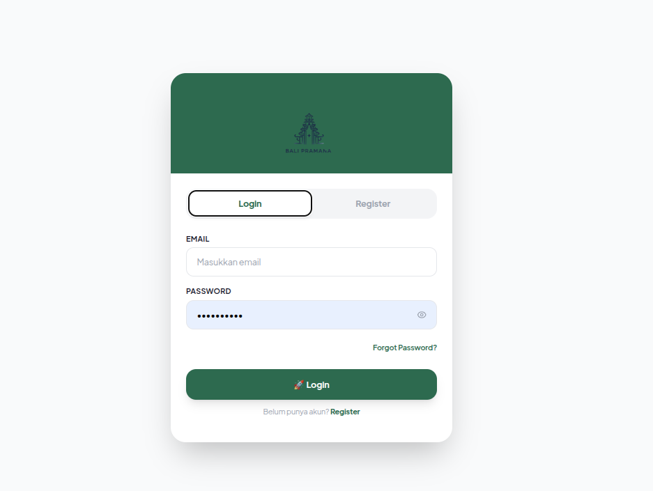
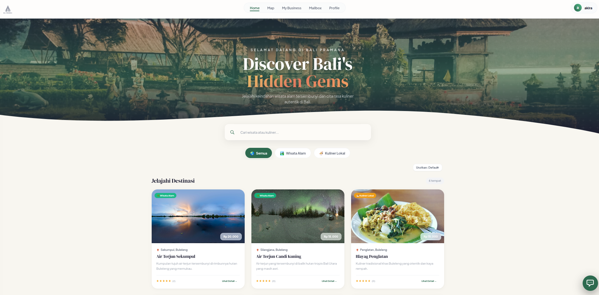
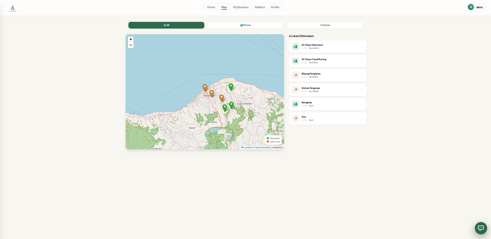
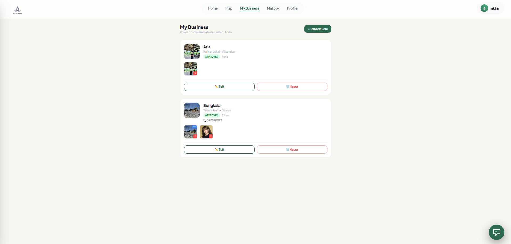
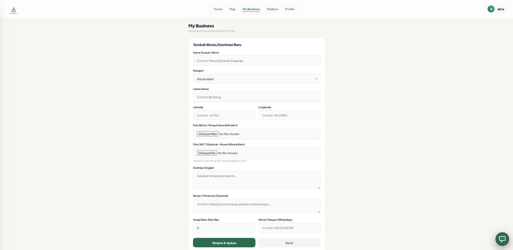
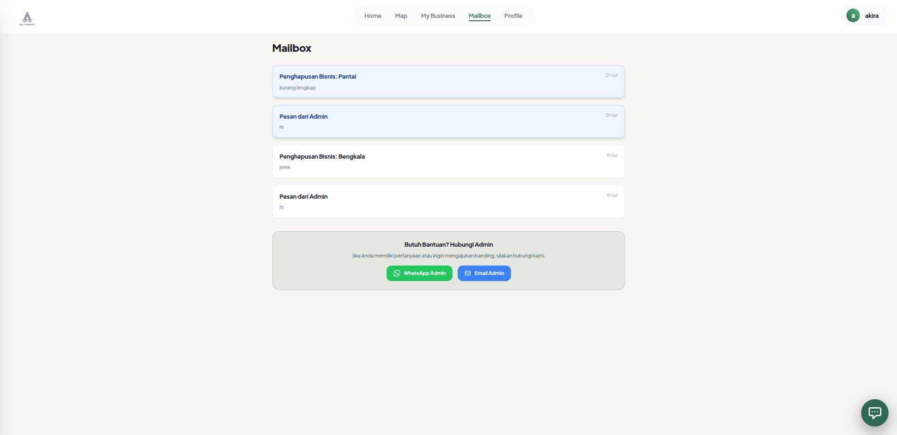
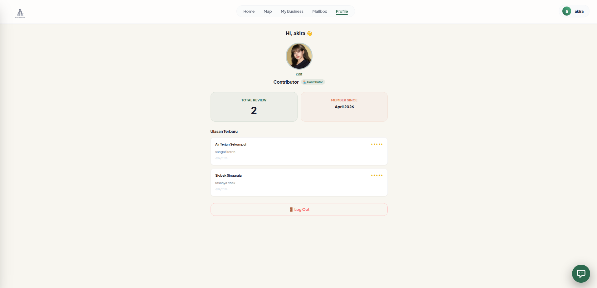

# 🌿 Bali Pramana
> **Digital Ecosystem for Hidden Gems & Local Culinary in Bali**

[](https://laravel.com)
[](https://react.dev)
[](https://tailwindcss.com)
[](https://inertiajs.com)

**Bali Pramana** adalah platform ekosistem digital cerdas yang dirancang khusus untuk mempromosikan destinasi wisata alam tersembunyi (*Hidden Gems*) dan cita rasa kuliner lokal autentik di Bali. Aplikasi ini dirancang dengan pendekatan *Mobile-First* untuk memudahkan wisatawan menjelajahi keindahan Bali langsung dari smartphone mereka, lengkap dengan integrasi peta interaktif dan *Virtual Tour 360°*.

---

## 📸 Preview Aplikasi (Perspektif Kontributor)
Berikut adalah alur antarmuka aplikasi Bali Pramana dari sudut pandang **Kontributor**. 

> [!NOTE]
> **Perbedaan Fitur Antar Peran (Role):**
> * **User Biasa (Wisatawan)**: Fitur lebih terbatas (hanya bisa menjelajahi beranda, melihat peta, melihat detail/360 virtual tour, memberikan rating/ulasan, dan mengelola profil). Tidak memiliki akses ke menu kelola lapak/bisnis.
> * **Contributor**: Memiliki seluruh fitur User Biasa ditambah menu **"Lapak Saya"** untuk mendaftarkan destinasi kuliner/wisata alam baru, mengupload foto 360°, serta berinteraksi via **Mailbox** dengan Admin.
> * **Admin**: Memiliki hak akses penuh untuk melakukan **moderat (menyetujui / menolak)** pengajuan tempat baru dari Kontributor melalui halaman dashboard admin dan membalas pesan moderasi di Mailbox.

*Silakan simpan file screenshot Anda di dalam folder `screenshots/` dengan nama file yang sesuai di bawah ini:*

### 🔐 Alur Registrasi & Masuk
<table width="100%">
  <tr>
    <td width="50%" align="center">
      <b>Halaman Registrasi Kontributor</b><br/>
      
      <br/><i>Pendaftaran akun kontributor baru (register.png)</i>
    </td>
    <td width="50%" align="center">
      <b>Halaman Masuk (Login)</b><br/>
      
      <br/><i>Masuk ke ekosistem Bali Pramana (login.png)</i>
    </td>
  </tr>
</table>

### 🗺️ Eksplorasi & Peta (Tampilan Utama)
<table width="100%">
  <tr>
    <td width="50%" align="center">
      <b>Beranda Utama (Home)</b><br/>
      
      <br/><i>Rekomendasi destinasi alam & kuliner di Bali (home.png)</i>
    </td>
    <td width="50%" align="center">
      <b>Peta Interaktif (Map)</b><br/>
      
      <br/><i>Pencarian lokasi wisata & kuliner terdekat (map.png)</i>
    </td>
  </tr>
</table>

### 💼 Manajemen Lapak & Detail Destinasi
<table width="100%">
  <tr>
    <td width="50%" align="center">
      <b>Kelola Lapak Saya (My Business)</b><br/>
      
      <br/><i>Daftar pengajuan tempat & form tambah lapak baru (lapak.png)<br/>
      💡 <b>Catatan Admin</b>: Pengajuan baru di sini akan muncul di Dashboard Admin untuk di-acc atau ditolak.</i>
    </td>
    <td width="50%" align="center">
      <b>Detail Destinasi & Virtual Tour 360°</b><br/>
      
      <br/><i>Tampilan detail tempat beserta fitur ulasan & foto 360° (lapak_detail.png)</i>
    </td>
  </tr>
</table>

### ✉️ Sistem Komunikasi & Profil
<table width="100%">
  <tr>
    <td width="50%" align="center">
      <b>Kotak Masuk (Mailbox)</b><br/>
      
      <br/><i>Pesan moderasi pengajuan lapak dari Admin (mailbox.png)</i>
    </td>
    <td width="50%" align="center">
      <b>Profil Pengguna (Profile)</b><br/>
      
      <br/><i>Informasi akun kontributor & pengaturan (profile.png)</i>
    </td>
  </tr>
</table>

---

## ✨ Fitur Utama
- 🌟 **Virtual Tour 360° Interaktif**: Menampilkan foto panorama 360 derajat di halaman detail menggunakan `Pannellum` untuk memberikan *experience* nyata sebelum berkunjung.
- 🗺️ **Peta Interaktif (OpenStreetMap & Leaflet)**: Navigasi visual untuk mencari lokasi wisata alam dan kuliner lokal terdekat dengan pin penunjuk lokasi.
- 🔑 **Multi-role Authentication (Laravel Breeze)**: Pembagian akses login berdasarkan peran user:
  - **Guest/User**: Mencari tempat wisata, melihat peta, menikmati tour 360°, dan menulis ulasan.
  - **Contributor**: Mengelola bisnis kuliner atau wisata alam milik sendiri, menambahkan ulasan, serta mengajukan tempat baru.
  - **Admin**: Menyetujui pendaftaran bisnis baru oleh kontributor, mengelola data pengguna, dan mengontrol sistem pesan moderasi.
- 📬 **Internal Mailbox System**: Fitur kirim pesan terintegrasi antara Admin dan Kontributor untuk mendiskusikan kelayakan data tempat/bisnis yang diajukan.
- 💬 **Sistem Ulasan (Review & Rating)**: Memungkinkan pengguna memberikan feedback, rating, dan komentar secara real-time pada destinasi.

---

## 🛠️ Tech Stack & Library
- **Core Framework**: Laravel 11 (PHP 8.2+) & React 18
- **State & Routing Bridge**: Inertia.js (React Adapter)
- **Styling**: Tailwind CSS
- **Interactive Maps**: Leaflet.js & React-Leaflet (OpenStreetMap)
- **360° Panorama Viewer**: Pannellum Viewer
- **Database**: MySQL / PostgreSQL

---

## 🚀 Panduan Instalasi Lokal

### 1. Prasyarat
Pastikan komputer Anda sudah terinstal:
- PHP >= 8.2
- Composer
- Node.js & npm
- Web Server & Database (XAMPP, Laragon, Docker, dll.)

### 2. Kloning Repositori
```bash
git clone https://github.com/ariawiduraa/Bali-Pramana.git
cd Bali-Pramana
```

### 3. Instalasi Dependency Backend & Frontend
```bash
# Instal dependency PHP
composer install

# Instal dependency Node.js
npm install
```

### 4. Konfigurasi Lingkungan (.env)
Salin berkas `.env.example` ke `.env`:
```bash
cp .env.example .env
```
Sesuaikan konfigurasi database Anda di dalam berkas `.env`:
```env
DB_CONNECTION=mysql
DB_HOST=127.0.0.1
DB_PORT=3306
DB_DATABASE=bali_pramana
DB_USERNAME=root
DB_PASSWORD=
```

### 5. Generate Application Key & Database Migration
```bash
# Membuat key aplikasi
php artisan key:generate

# Migrasi tabel database beserta data demo (seeders)
php artisan migrate --seed
```

### 6. Menjalankan Aplikasi
Buka dua terminal terpisah untuk menjalankan server lokal:

**Terminal 1 (Laravel Server):**
```bash
php artisan serve
```

**Terminal 2 (Vite Frontend compilation):**
```bash
npm run dev
```

Aplikasi siap diakses melalui peramban di alamat `http://127.0.0.1:8000`.

---

## 📂 Struktur Folder Front-End Penting
```text
resources/js/
├── Components/         # Komponen React reusable (Peta, 360 Viewer, dll.)
├── Layouts/            # Tata letak induk (MobileLayout.jsx dengan Bottom Nav)
├── Pages/              # Halaman-halaman utama aplikasi
│   ├── AdminDashboard.jsx
│   ├── AuthScreen.jsx
│   ├── DestinationDetail.jsx
│   ├── Home.jsx
│   ├── Mailbox.jsx
│   ├── MapScreen.jsx
│   └── MyBusiness.jsx
└── app.jsx             # Entry point React
```

---

## 👤 Informasi Project
- **Mata Kuliah**: Pemrograman Web Berbasis Framework
- **Dosen Pengampu**: Ir. Gede Surya Mahendra, S.Pd., M.Kom.
- **Nama Developer**: Aria Widura
- **Program Studi**: Teknologi Informasi, Universitas Pendidikan Ganesha
